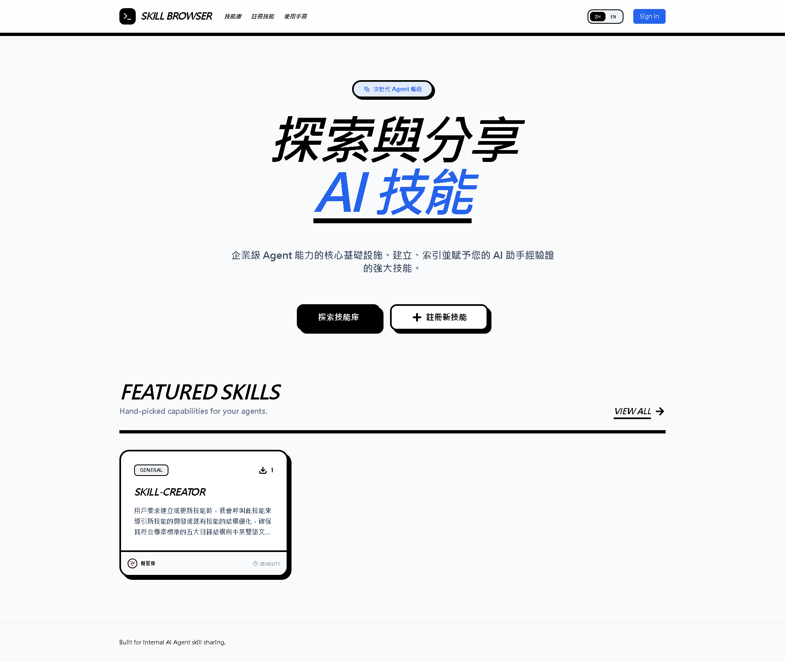
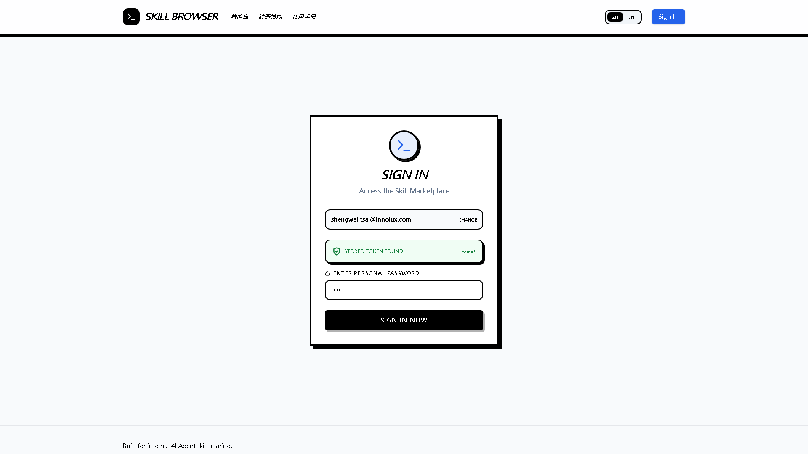
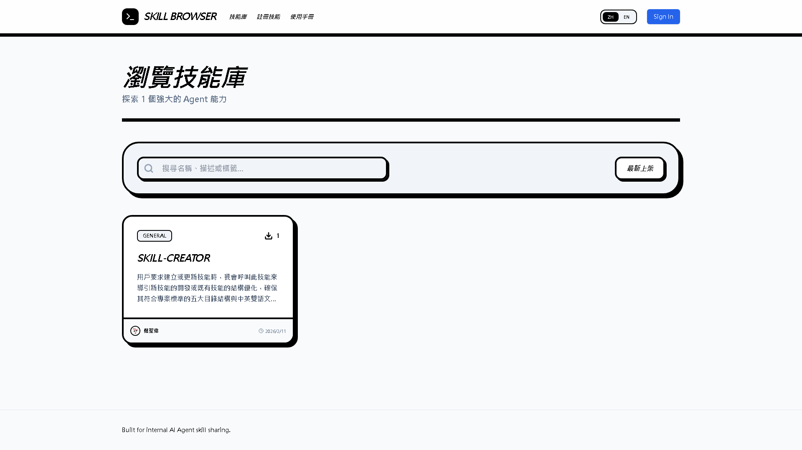
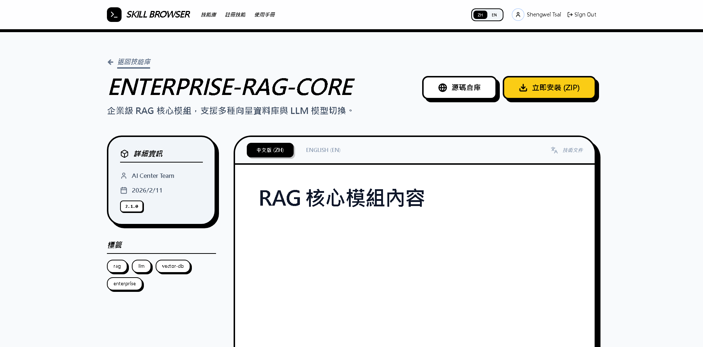
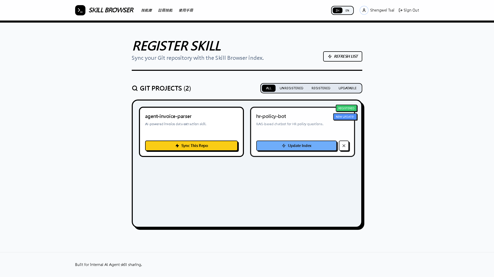

# Innolux Skill Browser 網站功能導覽

本文件介紹 Skill Browser 的核心介面與功能流程，包含系統實際截圖。
此版本包含詳細的登入與權限驗證流程展示。

## 1. 首頁 (Landing Page)
**核心價值：** 建立第一印象，強調「集中化」與「共享」的願景。

**功能亮點：**
*   **Hero Section：** 大標題「探索與分享企業級 Agent 技能」，明確傳遞平台定位。
*   **快速入口：** 提供「探索技能」與「分享技能」的雙按鈕 (Call to Action)。
*   **熱門推薦：** 自動展示星數最高或下載量最大的技能。

---

## 2. 安全登入機制 (Secure Authentication)
**核心價值：** 整合內部帳號並提供雙重加密保護，確保 Git Token 安全。

**演示情境：**
*   **使用者：** `shengwei.tsai@innolux.com`
*   **雙重驗證：** 系統偵測到此帳號已存在，要求輸入個人金鑰 (Personal Key) `1234` 進行解密。
*   **安全性設計：** 平台不儲存明碼 Git Token，僅儲存經此金鑰加密後的雜湊值，確保即使資料庫外洩，Token 依然安全。

---

## 3. 技能探索大廳 (Skill Discovery)
**核心價值：** 讓使用者像逛網拍一樣，輕鬆找到需要的 AI 工具。

**功能亮點：**
*   **卡片式設計：** 清楚呈現技能名稱、簡述、分類標籤 (Tags)。
*   **即時搜尋：** 支援關鍵字過濾，快速定位特定領域（如 PDF, SQL, Data）的技能。

---

## 4. 技能詳情與文件 (Skill Detail)
**核心價值：** 提供完整資訊，建立使用者的信任感與學習曲線。

**功能亮點：**
*   **雙語切換：** 支援中/英 (ZH/EN) 切換，讓不同語系的同仁都能無障礙閱讀。
*   **重點資訊 (Top View)：** 
    *   右上角醒目的 **「Install Skill」** 與 **「Repository」** 按鈕。
    *   清楚顯示作者 (`AI Center Team`) 與版本資訊。
    *   **安全狀態：** 若有潛在風險會顯示警告。

---

## 5. 無痛分享與上傳 (Share & Upload)
**核心價值：** 自動化索引，無需手動填寫繁瑣表單。

**演示情境：**
*   **自動偵測：** 登入後，系統自動列出 `shengwei.tsai` 名下所有帶有 `skill` 主題 (Topic) 的 Git 儲存庫。
*   **狀態儀表板：**
    *   **已註冊 (Registered)：** 如 `hr-policy-bot`，顯示目前狀態與是否有新版本 (`New Update!`)。
    *   **未註冊：** 如 `agent-invoice-parser`，點擊即可一鍵收錄。
*   **智慧判斷：** 系統會比對 Git 的 `pushed_at` 時間與資料庫紀錄，精準提示更新。

---

## 結語
Skill Browser 透過直覺的 Web 介面與嚴謹的安全設計，將原本複雜的程式碼分發過程，簡化為「搜尋 -> 查看 -> 下載」的三步驟體驗，大幅降低了 AI 工具在內部推廣的門檻。
